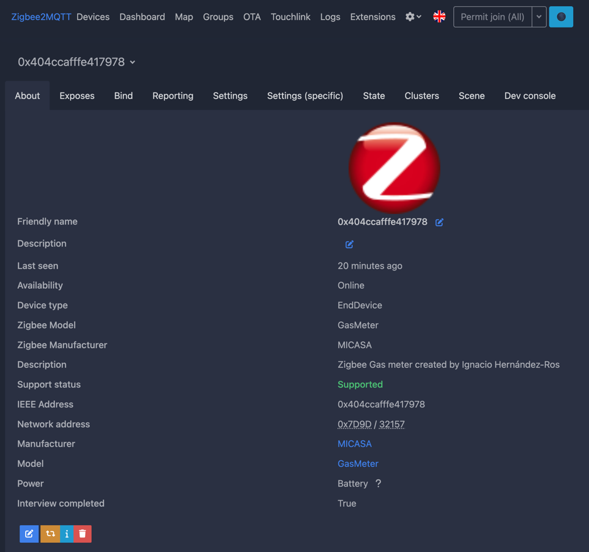
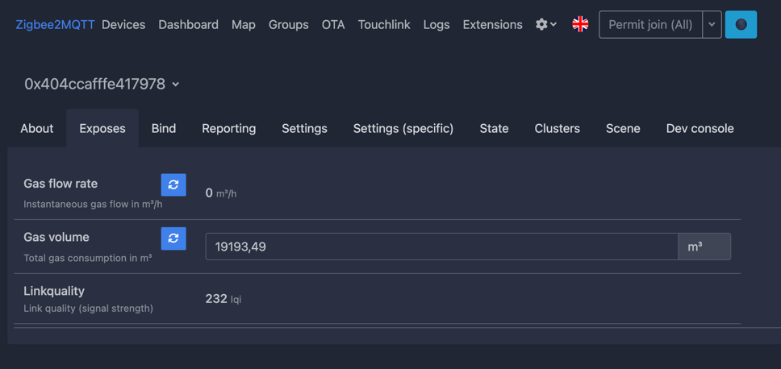
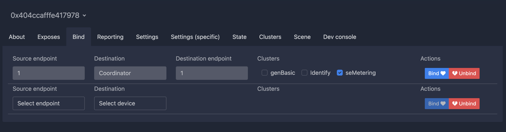
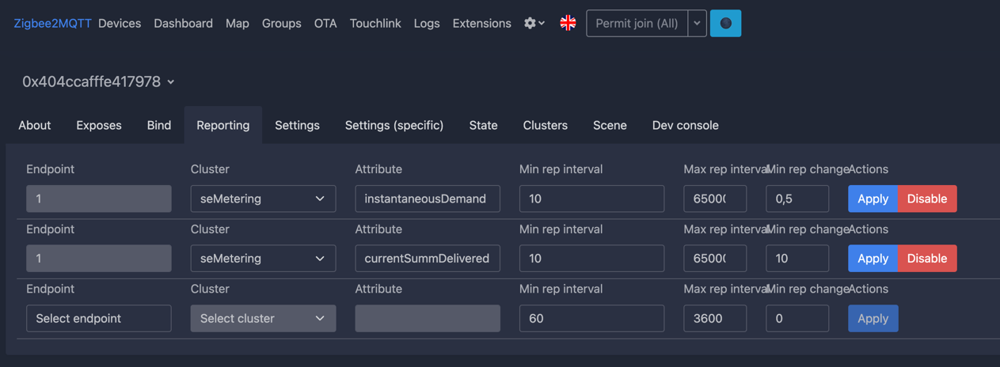
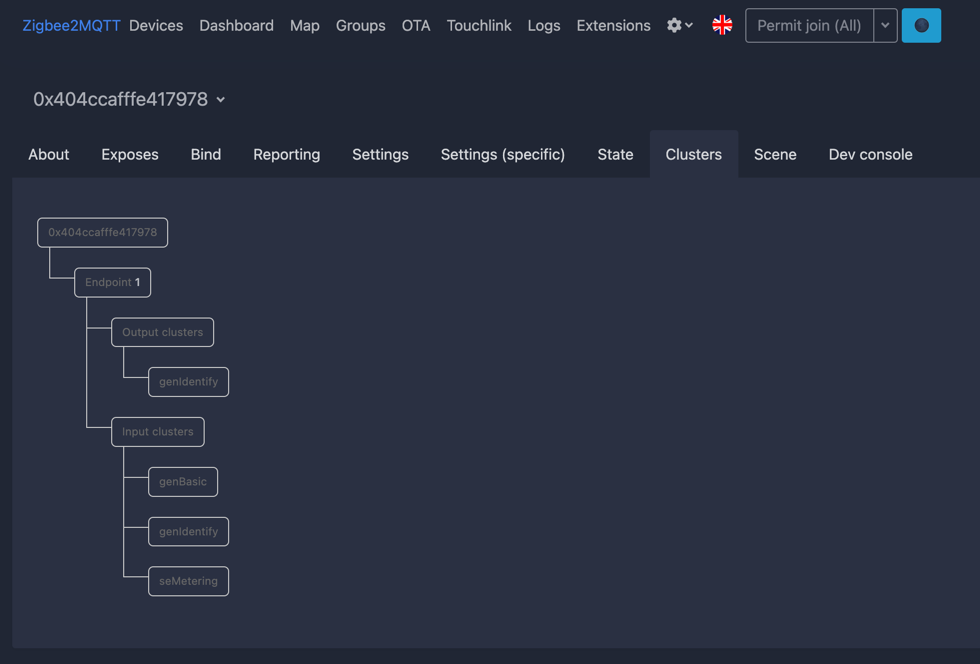
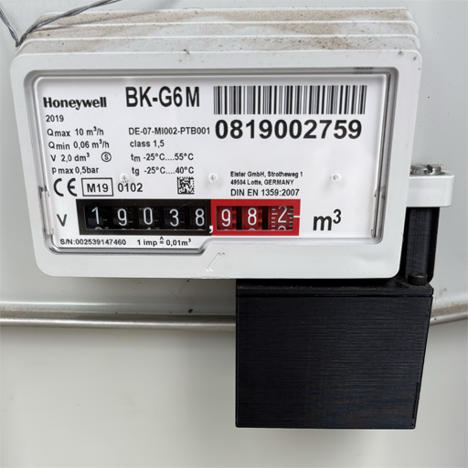

# Zigbee GAS counter

This code implements an autonomous counter for my gas meter at home that provides the total count to my Home Assistant for my own analysis. I've added this device to Zigbee2MQTT and here are some screen captures of how I see it.

## Project status

This project is in DEVELOPMENT status. As you can see in the screen captures almost the entire device works but there are still things in the TODO list (below) that I would like to sort out before installing it in my counter.

Here is a picture of the modified door sensor that I'm using to measure gas consumption.

Inside the 3d printed case there is a 3V CR123A battery. The design of the new device power is still not finished. Any help will be apreciated.

## Historical reasons and motivation

My gas counter at home has a wheel with a magnet that can be used to detect every wheel turn. Long time ago I modified a door sensor to notify Home Assistant each time the magnetic sensor detected a count and that has helped me to analyse the amount of gas consumed at home, but the solution had a couple of problems:

 1. I'd no electric power near the gas counter so the door sensor batteries last for 3 months
 2. If, for any reason, the Zigbbe network was down or the computer running Home Assistant was down, the counts was lost. After a few months the number of counts lost is about 1000 (10 cubic meters)
 3. The overall solution was complex, having to set up counters in Home Assistant and template devices and automations to react to the door sensor. Maintenance was very hard as there was no clean solution to set the counter to match the real counter (the counter helper service allows to set initial value, increase and decrease the value but setting the internal value is not an option as that impacts other energy meters that relay on the variations of that counter to measure daily conpsumption etc)

So, in the end I decided to get rid of all that stuff and purchase a Zigbee Counter, but... that product didn't exist in the market!! so I decided to create my own.

## Required Hardware

I wanted to spend the minimum amount of money to get ready to start the development. At first, I saw some zigbee development environments available for about 1,000.00€ that was a lot for a couple of experiments at home, in the meantime I started investigating the ESP32 family of processors with WIFI available and I also started creating some decives based on ESPHome. The problem about WIFI is that they consume a lot of energy and are not suitable for battery powered so I wait for the ESP32-H2 to be available and the ESP32-C6 was my final decision due to the relative small price and available Zigbee API documentation.

I spent almost 18 months waiting for ESPHome to provide a mechanism to develop zigbee devices in yaml but that didn't happen so At one point I started to read the Zigbee Specifications and available API including the examples from docs.espressif.com until I feel secure enough to start doing some tests.

The BOM is as follows:

- ESP32-C6 or development board for that ESP32-C6-WROOM-1
- 1 Resistor 10KΩ (pull down resistor)
- 1 magnet sensor switch
- 1 Battery CR123A

## Manufacturer information

As this is something I do for my own I've had to invent my own Manufacturer name and manufacturer code.

- Manufacturer name is "MICASA" that is two words in spanish "mi" and "casa". Translated to engligh is "my home". Note also that the "SA" termination in Spain translated to english is "join-stock-company" so someone could read it as a join-stock-company called "MICA" and that is fun!
- Manufacturer code is 0x8888 just because I'd to put one.

## SDK API Documentation

The ESP Zigbee SDK provides more examples and tools for productization:

- [ESP Zigbee SDK Docs](https://docs.espressif.com/projects/esp-zigbee-sdk)
- [ESP Zigbee SDK Repo](https://github.com/espressif/esp-zigbee-sdk)

## Configure the project

Before project configuration and build, make sure to set the correct chip target using `idf.py --preview set-target ESP32C6` command.

## Erase the NVRAM

Before flash it to the board, it is recommended to erase NVRAM if user doesn't want to keep the previous examples or other projects stored info using `idf.py -p PORT erase-flash`

## Build and Flash

Build the project, flash it to the board, and start the monitor tool to view the serial output by running `idf.py -p PORT flash monitor`.

(To exit the serial monitor, type ``Ctrl-]``.)

## Troubleshooting

For any technical queries, please open an [issue](https://github.com/espressif/esp-idf/issues) on GitHub. We will get back to you soon.

## TODO

- Implement battery information
- Long press of the external button shall leave the network and start rejoining again
- Design a board where I can place the ESP32-C6-WROOM-1 board, buttons, resistors, connector for the battery and the magnetic sensor
- Design a box I can print on my 3D printer to hold all hardware inside
